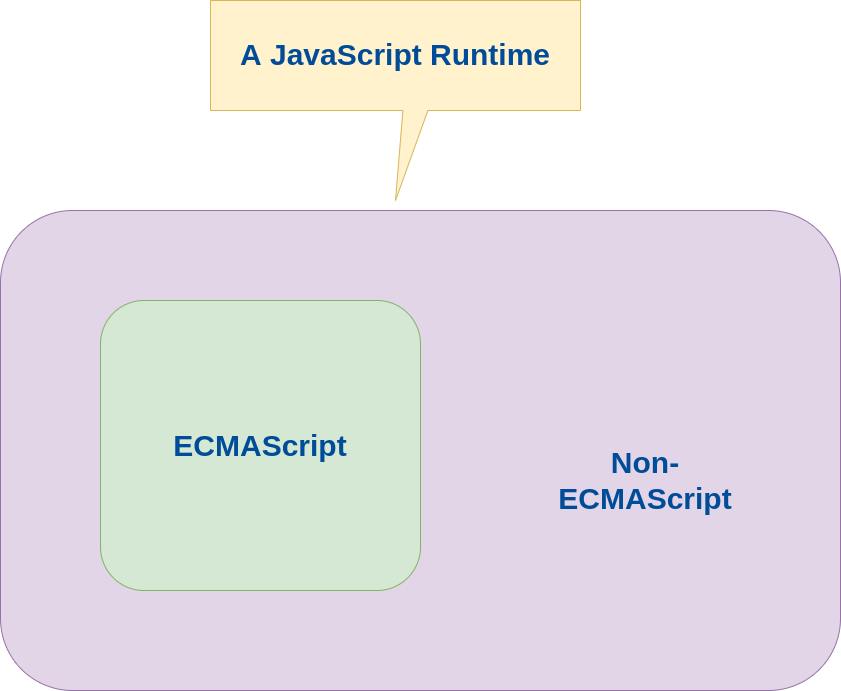

# `TypeScript` Setup


I first began with an extremely simple project consisting of the project structure in the  `./documentation/stack/typescript/initial-code` Folder

From there, I wanted the ./bin/index.js to be compiled from `TypeScript`, so I executed the following steps :

```bash
npm install --save-dev typescript @types/node

npx tsc --init --rootDir src --outDir bin

```

And tha's where this work began.

This work is about actually understanding how to start a new `TypeScript` project, a question which a lot of people have experienced, ending with les or more success.

In the present work, I will in the conclusion explain you :

* Why [this article](https://medium.com/@tommedema/typescript-confusion-tsconfig-json-module-moduleresolution-target-lib-explained-65db2c44b491) is completely wrong about probably every single one of its assertions.
  * That the work behind this article is very likely to be reduced to:
    * running `tsc --init --help`,
    * reading the `--target`, `--module`, `--moduleResolution`, `--lib` documentation, misunderstanding it completely, and imagining foolish things like the assetion about polyfill
  * That this article is completely missing the point especially about the `--lib` option, for one good reason :
    * because "front end people", are really not used to what copmpilation is,
    * for example they are not used to read and run a Makefile with several target systems,
    * an,other example those developers would not ever be able to just quote one or two Golang compiler options
    * even more than that, those people certainly have never worked with a framework like Spring,
    * and they certainly do not understand a pattern like Abstract Factory in Java
    * and they certainly do not understand what are:
      * methods / function dynamic polymorphism (passing as arguments, objects from different types, only assuming those types implement one same interface)
      * Java JRE Standard Override Mechanism :
        * It is based on the `-Djava.endorsed.dirs <path to directory containing jars to load>`
        * You can check in a java program the value of that `java.endorsed.dirs` Java JRE Sytstem variable, by excuting `System.getProperty("java.endorsed.dirs")`
        * This system is well known for example :
          * to set what implementation are used for networking example `CORBA` protocol used for webservices
          * to set a specific XML SAX parser https://docs.oracle.com/javase/8/docs/technotes/guides/standards/
      * see https://docs.oracle.com/javase/8/docs/technotes/guides/standards/ , the "`Endorsed Standards`" section.
      * How you can implement an inversion of control / modularization framework using sring like techniques :
        * in a configuration file, we find class names for objects, and maybe the path to the binary defining those classes
        * the ioc program creates instances of that type (a Class is a Type), providing those classes do implement a given interfaces: in Spring Framework, that's called beans
        * the program managed by ioc, runs with the provided instances, to complete its tasks.
        * i will demo that :
          * i will implement an ioc program and will deploy a demo app into that container
          * i will compare using a rather recent java framework : https://quarkus.io/ and springboot
          * all in distroless containers
* How [this other article](https://docs.joshuatz.com/cheatsheets/node-and-npm/node-esm/#typescript---fully-resolved-import-filepaths-with-extensions) :
  * shows much more interesting content about the problem of starting a TypeScript / NodeJS ESM Module project
  * is astonishingly related to the reasons why I am developing `Hugo-Gmented`, starting with this repo's npx module, see indeed :
    * [this other article](https://docs.joshuatz.com/cheatsheets/node-and-npm/node-esm/#typescript---fully-resolved-import-filepaths-with-extensions) was made by `joshuatz` on his personal website https://joshuatz.com/
    * `Joshua TZ` made his personal website https://joshuatz.com/ using the [Gatsby](https://gatsby.io) 's Headless CMS, while I made my personal website using `Hugo` :
      * There are 2 families of headless CMS , in this world : the Git based headless CMS, and the API based Headless CMS,
      * Hugo is the world 's number one Git-based headless CMS by far
      * Gatsby is the world's number one API-based headless CMS by far
      * all other headless CMS in the world are in iether of those families, there are even hybrids, but none of them match `Gatsby` and `Hugo` :
        * directus
        * strapi
        * etc...
    * `Joshua TZ` 's Gtihub profile https://github.com/joshuatz has a few good looking and interesting things :
      * How come he also worked with cloudinary :) (his little tool is interesting as far as pokus is concerned) : https://github.com/joshuatz/desktop-cloud-transform
      * `Hugo Gmented` is related to one of my main projects : `Pokus`
      * In one of the website project i worked on using `hugo`, I started indeed using image CDN management for deployment, especially using Gulp tasks for image processing :
        * I used gulp taks to process tasks on iamge files : resizing, compressing, image transformations (adding special effects like blurring)
        * I used deployment pipeline to deploy gulp processed images to iamge CDN :
          * one gulp tasks would deploy image files to a CDN , in dev environment ( a local iamge CDN installed with docker comppose, it could even be directus used as a pure CDN)
          * one gulp tasks would deploy image files to a CDN , in staging environment : cloudinary, if cloudinary accepts multiple envionments / organizations. I cloudinary would not support multiple organizations or environments, i will use Optimole on staging.
          * one gulp tasks would deploy image files to a CDN , in production environment : cloudinary and / or Optimole, the one that has
          * best would be that iamge CDNs support environment concept, in order to be able to have staging and production CDNs, and without relying on that, here is how i will implement that :
            * staging and production environment images will be deployed to Cloudinary and Optimole: for each image, it is deployed either to Optimole, or to Cloudinary
            * the same image, deployed to staging and production environments, changes only by the path to access the image. the change is made in the image file name using `${IMAGE_FILENAME}` for production,  `staging_${IMAGE_FILENAME}` for staging
            * problem there, is that production is always up :
              * we want to use as much as possible in the limits of any kind of plan: so we test that ability to manage not exceeding any given plan, using only free plans
              * our goal is to deploy a set of images, across multiple CDNs, to take advantage as much as possible from all free plans of a given service, relying on multiple service providers
              * Ok, so what will do constantly here is executing a gulp tasks which :
                * for each iamge file
                * upload the image file to one of the CDNs, based on a yaml configuration file `dogman.yaml`
                *
        * I naturally started looking for all image CDNs offering free plans, and among them I found `Cloudinary` : so did `Joshua TZ`, i think most fullstack developers / frontend devs who have worked in large websites projects, start by trying Cloudinary


All in all, in a scond episode of this article we will :

* Explain in detail ARchitecture at the center of all of this : Our TypeScript app lifecycle architecture, from source code to deployment
* Explain what it is that front end dev don't understand :
  * building a Goglang executable for different target artchitectures
  * building a C language executable for different target artchitectures
  * building 2 C language executables and make use of an API : programming a simple plugin system in C Language, with an API concept
  * Building two Java applications to demonstrate programming a simple plugin system in C Language, with an API concept :
    * we wil also demonstrate invrersion of Control and Dynamic Polymorphism patterns


That will show what we actually mean by interface


## Making sense of your `tsconfig.json` `TypeScript` configuration


### Dockie Tests First

To counter check the whole `TypeScript` Setup, independently from my bare metal machine, I used a Docker image.

I used a Docke Alpine in which I installed the whole stack, starting with `nodejs`.


```bash
docker exec -it testnode-alpine sh -c "apk update && apk add nodejs tree bash"
docker run -itd --restart always --name testnode-alpine alpine /bin/sh
docker exec -it testnode-alpine sh -c "pwd && ls -alh"
docker exec -it testnode-alpine sh -c "apk update && apk add nodejs && apk add --update npm"

docker exec -it testnode-alpine sh -c "node -v"
docker exec -it testnode-alpine sh -c "npm --version"
docker exec -it testnode-alpine sh -c "npx --version"

# Now let's create the nodejs/typescript project :

docker exec -it testnode-alpine sh -c "mkdir ./my-ts-project/"
docker exec -it testnode-alpine sh -c "cd ./my-ts-project/ && npm init --yes"
docker exec -it testnode-alpine sh -c "cd ./my-ts-project/ && npm i --save-dev typescript @types/node"
# below, just to confirm tsc is NOT installed globally
docker exec -it testnode-alpine sh -c "echo 'just to confirm tsc is NOT installed globally' && which node && which tsc && tsc --version"
docker exec -it testnode-alpine sh -c "cd ./my-ts-project/ && npx tsc --version"
docker exec -it testnode-alpine sh -c "cd ./my-ts-project/ && npx tsc --init --rootDir src --outDir bin"
docker exec -it testnode-alpine sh -c "cd ./my-ts-project/ && tree -alh -L 3"

docker exec -it testnode-alpine sh -c "cd ./my-ts-project/ && tree -alh -L 3"

# ---

# This is the fatest way to check the GNU Help of your tsc :
docker exec -it testnode-alpine sh -c "cd ./my-ts-project/ && touch ./tsc.compiler.help.txt && npx tsc --help --all 2&1> ./tsc.compiler.help.txt"

docker exec -it testnode-alpine sh -c "cd ./my-ts-project/ && cat ./tsc.compiler.help.txt | grep -A5 noEmitHelpers"

docker exec -it testnode-alpine sh -c "cd ./my-ts-project/ && cat ./tsc.compiler.help.txt | grep -A5 noImplicitAny"


# --- Now I re-generate the whole project to run the build with gulp

# plan: i will generate a script file and execute it as shell script in container

npx tsc --init --rootDir ./src --outDir ./bin.gmented \
  --target "es2020" --module "es2020" \
  --strict true --alwaysStrict true --allowJs true --noImplicitAny true --experimentalDecorators true \
  --esModuleInterop true --resolveJsonModule true


# npx tsc --init --rootDir ./src --outDir ./bin.gmented \
#   --target "es2022" --module "es2022" \
#   --strict true --alwaysStrict true --allowJs true --noImplicitAny true --experimentalDecorators true \
#   --esModuleInterop true --resolveJsonModule true
#
```


Note that at the time this test was executed, I had the following stdout outputs :

```bash
~$ docker exec -it testnode-alpine sh -c "node -v"
v16.15.0
~$ docker exec -it testnode-alpine sh -c "npm --version"
8.10.0
~$ docker exec -it testnode-alpine sh -c "npx --version"
8.10.0
~$ docker exec -it testnode-alpine sh -c "echo 'just to confirm tsc is NOT installed globally' && which node && which tsc && tsc --version"
just to confirm tsc is NOT installed globally
/usr/bin/node
~$ docker exec -it testnode-alpine sh -c "cd ./my-ts-project/ && npx tsc --version"
Version 4.7.2

~$ docker exec -it testnode-alpine sh -c "cd ./my-ts-project/ && tree -alh -L 3"
[4.0K]  .
├── [4.0K]  node_modules
│   ├── [4.0K]  .bin
│   │   ├── [  21]  tsc -> ../typescript/bin/tsc
│   │   └── [  26]  tsserver -> ../typescript/bin/tsserver
│   ├── [ 823]  .package-lock.json
│   ├── [4.0K]  @types
│   │   └── [4.0K]  node
│   └── [4.0K]  typescript
│       ├── [8.3K]  AUTHORS.md
│       ├── [ 333]  CODE_OF_CONDUCT.md
│       ├── [ 812]  CopyrightNotice.txt
│       ├── [9.0K]  LICENSE.txt
│       ├── [5.2K]  README.md
│       ├── [2.7K]  SECURITY.md
│       ├── [ 37K]  ThirdPartyNoticeText.txt
│       ├── [4.0K]  bin
│       ├── [4.0K]  lib
│       ├── [4.0K]  loc
│       └── [3.8K]  package.json
├── [1.6K]  package-lock.json
├── [ 313]  package.json
└── [ 11K]  tsconfig.json

8 directories, 14 files

```


### It's now time to use our brain: the `tsconfig.json`

The `tsc` executable is the `TypeScript` compiler.

Any GNU Option of the `tsc` `TypeScript` compiler match a configuration option in the `tsconfig.json` file :
* For any `tsc` compiler Option, we can choose to specify the option value, either by using a GNU Option, or a configuration property in the `tsconfig.json`.
* To execute the `tsc` compiler command with as little GNU Options as possible, the `tsc --init` will persist all compiler GNU Options in the `tsconfig.json` file.

To generate the `tsconfig.json` of our `TypeScript` project, we are all used to run the `tsc --init` command.

The `tsc --init` command has numerous GNU Options, all of which allow to change the resulting content of the generated `tsconfig.json`. I will refer to those `tsc --init` command GNU Options, as _**the `TypeScript` configuration options**_

For example if we execute the `TypeScript` compiler :
* without the `tsc --init` GNU Option command.
* and with the `tsc --noEmit` GNU Options, we can compile the `TypeScript` code without generating the compiled `JavaScript` code:
  * So this useful for just checking that your source code compiles, without generating any file (makes the compilation checks faster)
  * Another interesting variant of the `tsc --noEmit` GNU Option, is the `tsc --noEmitOnError` GNU Option: If any compilatin Error, no files are generated


#### Achille

> _**Compiled or Interpreted**_

There are only 2 ways to execute a JavaScript Software on a given machine :
* **Compiled `JavaScript`** : Either we compile the JavaScript to machine native language, just like C language
* **Interpreted `JavaScript`** : Or the JavaScript code is interpreted by a JavaScript Runtime, which turns the JavaScript code into the target machine native language. Those Runtimes are multiple, an,d may use techniques such as "Just In Time" transforamtions, which aim at optimizing the runtime performances.

Today, a vast majority of the `JavaScript` softwares are executed as **Interpreted `JavaScript`** : through a Runtime, that transform JavaScript into the target machine native language.

I just want to mention that there exists context where **Compiled `JavaScript`** is absolutely awesome and extremely interesting. I have for example heard of people working in hardware reverse engineering, where the y use JavaScript to dump CPU data from JTAG (Awesome ! :D )

> _**JavaScript Core**_

Right, now, realize this :
* Imagine you are writing a software, which drives a robot.
* Iamgine that the programming language you are going to use, is called The `Achille` Languague (it's a hero language).
* Imagine this robot has 2 arms and 2 legs.
* What commands do you expect to find in this language?
* Well of course, you would expect to find the commands to move each of the legs, and each of the arms, (together, or one after the other, all sorts of combiantions, etc...), right ?
* I agree with you.

Ok, so you loooove Robotics, that's why you learned the `Achille` Languague. It took you efforts, you spent hours, daays, weeks, months to get to be an expert in this language, didn't you ?

And now you want to develop a software to work with another robot :
* This new Robot does not have arms, neither does it have arms, but instead it has rockets to fly, and wheels to roll on a raod. Its name is `Bumblebee`.
* Well, oh, the the `Achille` Languague, as you learned it, has commands to move arms and legs, but not to turn on/off rockets and tune its thrust power!
* Ouch ! You have to make a pull request in the Github repo of the Achille languague, to that is is able to turn on rockets, and tune its rocket thrust, etc...!
* What would such a PR look like ?
* Of course, the PR would not submit Achille language :
  * It would submit Assembly languague, that can be executed into the `Bumblebee` CPU,
  * to be able to turn on/off rockets, and control the wheels and the wheels gaz engine, etc...
* The new version of the Achille Language :
  * has now new commmands, to control wheels , wheels engine, and rockets
  * and it still has the commands to move arms, and legs
* But hey, Why would I use an Achille compiler that can compile legs or arms commands, when i work on Bumblebee that has no legs and no arms ? It really is unuseful thing, and we are excellent engineers, we always get rid of anything unuseful.
* Okay, so in the new version of Achille Language, i strip out the arm and legs commands.

Okay, now, my point is:
* if you change enough the Robot, you may end up with changing completely, 100% of all the Achille Language,
* So the 2 versions of the Achille language, have zero commands in comman, so they actually are 2 comletely different languages, (so Why call it the Achille Langguage at all, after all those changes ?)

In the end, you may wonder: Hey, but what actually is the Achille Language ?


In all programming languages, there are two types of "commands" (actually called _words_ and _sentences_, in the language theory) :
* the commands that are related to a specific hardware (like moving arms, legs, tturning rockets on/off etc...)
* the commands that have nothing to do with any hardwar at all :
  * adding numbers does not depend at all on what hardware you run on, the operation has the exact same meaning and result, whatever the machine number representation is.
  * same about multiplying numbers
  * same about modus operations
  * same about boolean operations
  * same about quick sort algorithm (the quick sort algorithm is the same no matter the  hardware)
  * same about the _words_ the Achiell Language uses to add a dependency used in my software
  * etc...

In other words, The part of the Achille Language which does not depend on the hardware, the _target Runtime_, where the software is going to be executed, is what actually what makes the Achielle Language. We could speak of the Achille _core_ language.

This may seem a long explanation, but very worthy: What is the Java Script Language?


Since you are interested into JavaScrtipt, you do know that `JavaScript` Softwares are executed in a lot of different _target Runtimes_ :
* browsers. And among browsers there are different JavaScript Runtimes indeed: they do execute the same code with different results)
* `nodejs`.
* All of those Runtimes still execute code from the same language, `JavaScript`, and are all indeed JavaScript Runtimes, because :
  * they may execute the same `JavaScript` code with different result
  * but they do, and must, be able to execute the same JavaScript core language commands, even if the result may vary a little (otherwise you wopuld have to write completely different source cdoe for each browser, for example, and there would be no `JavaScript` at all).

In order to ensure that all `JavaScript` Runtime can all execute the same `JavaScript` core commands, the `JavaScript` Runtimes developers agreed on standardizing a part of their Runtime : That standardization gave a subset of the JavaScript Language, called EcmaScript.

Or said otherwise, if you write a pure `ECMAScript` software, it will be able to be executed by all `JavaScript` Runtimes.

* `ECMAScript` is the JavaScript core language,
* `JavaScript` Runtimes all are supersets of an `ECAMScript` runtime, standardize by the ECMAScript standard. (consider ECMAScript as a theoritical JavaScript, that you may implement for any target hardware in, the future)
* `JavaScript` Runtimes differ from each other, only "out of the `ECMAScript` scope"



Therefore, one extremely important choice to do (but  not the only one), when designing the `TypeScript` configuration of your project, is to determine what version of `ECMAScript` will be used in the target `JavaScript` Runtimes  of your app users.

Now, let's mention a few examples, about the part that makes the differences between different JavaScript Runtimes :

* A browser `JavaScript` Runtime will always include a "DOM" Library: that is not `ECMAScript`. For example, usually in `NodeJS` server side apps lke ExpressJS Apps, you do not have (and do not need) any DOM Library.
* A modern Browser `JavaScript` Runtime will include a web worker library (for PWA web apps), But you will generally speaking not ever find or use a webworker library in a NodeJS server.
* etc... etc...


> _**Architecture**_

Among the `TypeScript` configuration options that very often are really not clear there are :
* Some take in values like `es5`, `es6`, `es2017` (Wtfuss ...?) :
* Some take in a very well known value , aka `CommonJS` (Wtheck ...?) :

To fully configure our `TypeScript` Compiler, let's first have a look on the big Picture, considering only the case of an  **Interpreted `JavaScript`** :


The first one very important thing to always bear in mind, when developing your JavaScript application, is to determine what are the `JavaScript` Runtimes you want your app to run on : it will determine how many, and what users will be able to run your `JavaScript` software.

Another bunch of questions is very important to answer to :
* Will you compile your `JavaScript` source code, with the exact same `TypeScript` configuration for all your users target `JavaScript` Runtimes ?
* For most `TypeScript` projects, the answer is yes:
* But you may still use several different `TypeScript` configurations to compile the app differently for  different environments:
  * dev,
  * staging,
  * and production environments,
  * and that's complex enough, for you to be willing to use the same `TypeScript` configuration for all your target users JavaScript Runtimes.

Compiling a `TypeScript` source code results in a very simple delivery: you generate `JavaScript` files.


For the generated `JavaScript` code, we also want to determine what kind of modularization will be used :
* of course `TypeScript` Compilers generate modularized JavaSCript, because we always want modularization in any neat source code, both for debugging and also for runtime optimization
* you may use `CommonJS` : this is not part of `ECMAScript`
* you may use `ES 7` : this is part of `ECMAScript`
* You may use [`AMD` modules](https://requirejs.org/docs/whyamd.html) : and that's not `ECMAScript`
* etc...

Making a choice about what kind of modularization you will use in your source code, is very important : If not part of `ECMAScript`, your users target Runtimes may not support executing your generated `JavaScript` code.

All in all :
* compiling is about generating and bundling together JavaScript files,
* and all `TypeScript` options  are just configuring options about how the `JavaScript` code will be generated :
  * style,
  * will i use `require` of `import`, etc...


#### Dive in Compiler Options details

Okay, so, now that we have our big picture in mind, here are the questions we want to answer to, in order to determine the exact configuration we want to use in our `TypeScript` project :

* Do I want to force using explicit typing everywhere ?
  * _Indeed, in `TypeScript`, if no type is explicitly defined for a given variable or method argument, the `Any` Type is implicitly assigned.
  * All other Types must be explicitly declared. `Any` is a bit like the `Object` Type in `Java`. We may like or not like this implicit typing. I do not like imlicit tping, I always like everything clear (that's why I use `TypeScript`, not `JavaScript`)._
  * That's why we will use the `--noImplicitAny true` GNU Option, so the TypeScript compiler forces all types to be explicitly declared ofr any variable / method argument
* Do I want to use non-EcmaScript libraries in my softwware ?:
  * Those non-`ECMAScript` dependencies could for example be the `DOM API` or a `WebWorker API` (for browsers for example)
  * If I do use non-`ECMAScript` dependencies in the source code of my `JavaScript` Software, then I ned the interfaces of those APIs, to compile my source code.
  * That's the purpose of the `--lib` GNU Option
  * we will set `--lib` to its default value `undefined` : so we will not use the `--lib` GNU Option
  * Note the libraries you can import using that `--lib` are exactly those installed when you `npm i --save-dev typescript`, that exactly is libraries made of type declarations from the `TypeScript` standard library (provided by the installation).
* What kind of `JavaScript` Modularization will use the generated code ? 5same question as )  What kind of `JavaScript` Modularization will be supported by the target `JavaScript` / `ECMAScript` Runtime ? (`AMD` modules / `ES` Modules / `CommonJS` Modules etc...) :
  * **`--target`** : that option helps us specify what is commonly called _"The `JavaScript` version"_, but should be called  called _"The `ECMAScript` version"_ :
    * that's the version of ECMAScript we want the compiler to use to generate JavaScript code.
    * So it won't necessarily spcify what kind of modularization will be used, but it never the less sets "The JavaSCript core version"
    * As this article is written, we are middle 2022, so i will use `--target "es2020"` : that, because TypeScript from 2021 is just one year old, can't speak too young, `2020` is old enough (to begin speaking, aka having a stable language a lot of people talk).
  * **`--moduleResolution `** :  That's about the type of modularization in the TypeScript code tyou write :
    * Specify how `TypeScript` looks up a file from a given module specifier.
    * one of: `classic`, `node`, `node16`, `nodenext`
    * This option never the less is infered a value, from the value of the `--module` GNU Option :
      * less or more, the compiler considers you implicitly mean to use the same modularization technology fot bot the source of the compilation process (your `TypeScript` source code), and in the target of the compilation process (the generated `JavaScript`)
      * default: module === `AMD` or `UMD` or `System` or `ES6`, then `Classic`, Otherwise `Node`
    * That GNU Option was worth mentioning, even though we will not use it just let it take its implicitly infered from `--module` default value.
    * Actually after running a few tests on my configuration, i :
      * found out that to be able to compile the `TypeScript` source code in my `gulp.pokus.ts` Gulp File, and in particular to be able to use the [`gulpclass` `npm` package](https://www.npmjs.com/package/gulpclass), i must use the `--moduleResolution node` GNU Option of the `TypeScript` compiler.
  * **`--module`** : That's about the type of modularization in the generated `JavaScript` code. That option helps us specify what modularization type is used when compîler generates JavaScript :
    * main options are `none, commonjs, amd, umd, system, es6/es2015, es2020, es2022, esnext, node16, nodenext`
    * we will choose `--module "es2020"`, and we will use the `--esModuleInterop`  to ease importing requirejs modules
  * **`--resolveJsonModule true`** : We use that option to enable importing `.json` files (like configuration files `import configuration from './path/to/my/configurationFile.json'`).
  * **`--rootDir` and `--outDir`** GNU Options are here :
    * to specify in which folder the soruce code to compile resides,
    * to specify the path to the folder in which will the compiler put the generated `JavaScript` Files.
    * we will use ` --rootDir ./src --outDir ./bin.gmented`
  * We will **`--allowJs true --checkJS true`** to allow `JavaScript` files to be a part of our program. In addition, we use the '--checkJS' option to get errors from these files.
  * We will use the `--strict` option to set all strict options to true, and we will also use the `--alwaysStrict` GNU Option to ensure 'use strict' is always emitted in all the generated `JavaScript` files.
  * There are some other options which are interesting for building a production ready build, among which :
    * Using the `--noEmitHelpers` option guarantees that the `TypeScript` compiler does not inject any _"TypeScript compiler Helpers"_ in the generated source code. That can drastically reduce the size of the generated `JavaScript`. About that an execlellent article by **Marius Schulz** : [What are TypeScript compiler Helpers](https://mariusschulz.com/blog/external-helpers-library-in-typescript)
    * Using the `--removeComments` option removes all comments from the generated `JavaScript`
    * An example of [a production build according a framework vendor like `Adonis`](https://docs.adonisjs.com/guides/typescript-build-process#standalone-production-builds) shows the main steps of whta they mean is a production build for a TypeEscipt application :
      * Clean the existing build directory (if any).
      * Build your software's static assets :
        * If the software is a frontend app : Build your frontend assets.
        * If the software is a Nodejs executable, well it still may use static assets like a CLI would:
          * like in the logs,
          * or even logos in the OS where the executable is running
          * so here this task is about building static assets (images, mp4 videos, mp3 sounds) :
            * normalize static assets sizes: for example for images, the images could be resized into multiple sizes formats, for responsiveness
            * compress static assets :
              * image files (i have a lot of gulp examples too)
              * compress `mp3` files
              * compress `mp4` files [example using `ffmpeg`](https://gist.github.com/lukehedger/277d136f68b028e22bed) (`ffmpeg` probably will help with `mp3` too) see also https://github.com/psirenny/gulp-fluent-ffmpeg
            * apply transformations on static assets :
              * it might be special effects
              * like blurring pictures, or transforma a voice of a sound,
            * That's all Build your software static assets.
      * Use the `TypeScript` compiler to:
        * Compile the `TypeScript` code to `JavaScript`
        * And write it inside the build folder.
        * This time, we do perform type checking and report the `TypeScript` errors.
        * So we will use all verbose options etc..., strict options for JavaScript etc..
      * Copy all the static files to the build folder. The static files are registered to the software using them using configuration files at runtime.
      * Copy the `package.json` and `package-lock.json`/`yarn.lock` to the build folder.
      * Generate manifest file(s) in the build folder : depending ont he technolgies used, thess files generally contain meta-data about the package that's being built. Like Release Notes, Supported runtime list, Git commit ID, link to Release Notes, etc...
    * Then, to be able to use `TypeScript` language in the `gulp.pokus.ts` `gulpfile` itself,  I have to Use the `--experimentalDecorators` GNU Option of the `TypeScript` compiler :
      * to enable experimental support for TC39 stage 2 draft decorators.
      * That, for Otherwise the `GulpClass` type will not compile.


All in all, this gives us the following tsc command to generate our donfiguration :

```bash

npx tsc --init --rootDir ./src --outDir ./bin.gmented \
  --target "es2020" --module "es2020" \
  --strict true --alwaysStrict true --allowJs true --noImplicitAny true --experimentalDecorators true \
  --esModuleInterop true --resolveJsonModule true


# npx tsc --init --rootDir ./src --outDir ./bin.gmented \
#   --target "es2022" --module "es2022" \
#   --strict true --alwaysStrict true --allowJs true --noImplicitAny true --experimentalDecorators true \
#   --esModuleInterop true --resolveJsonModule true

```


## ANNEX A : `tsc --init` Reference Examples

* First example :

```bash
npx tsc --init --rootDir src --outDir build \
  --esModuleInterop --resolveJsonModule --lib es6 \
  --module commonjs --allowJs true --noImplicitAny true

```

* Second example from [here](https://gist.github.com/jacobrastad/4d73b5cd7334d7b99e67950deb15731d#create-project-structure) :

```bash
# ---
#
tsc --init --rootDir src --outDir build \
   --target es2020 --lib ES2019 --esModuleInterop \
   --resolveJsonModule --module commonjs \
   --allowJs true --noImplicitAny true \
   --sourceMap true

   ```

* Third example from [here](https://gist.github.com/mkuchak/fb02b6e772503e345733bb68de68e944#starting-with-typescript-on-new-project) :

```bash

# ---
# In this example, you can see the engineer uses the [--lib] to work with browsers dom
npx tsc --init --rootDir ./ --baseUrl ./ --outDir ./dist \
  --strictNullChecks false --esModuleInterop --resolveJsonModule \
  --lib "esnext,dom" --module commonjs --allowJs --sourceMap \
  --removeComments --experimentalDecorators --emitDecoratorMetadata \
  --typeRoots "./node_modules/@types,./src/@types"
```


## ANNEX B : _**What Version of `EcmaScript` exist ?**_

For the record, here are all the versions of TypeScript available from `2015` to `2022` :

|         |  Short   |  Long     |         |         |
|---------|----------|-----------|---------|---------|
|         | `ES6`    | `ES2015`  |         |         |
|         | `ES7`    | `ES2016`  |         |         |
|         | `ES8`    | `ES2017`  |         |         |
|         | `ES9`    | `ES2018`  |         |         |
|         | `ES10`   | `ES2019`  |         |         |
|         | `ES11`   | `ES2020`  |         |         |
|         | `ES12`   | `ES2021`  |         |         |
|         | `ES13`   | `ES2022`  |         |         |


Now, which will i choose ?

For any software, my choice would go for the latest stable.

Now, here are reference articles where the question "What version of `ECMAScript` should I use in a `TypeScript` Project (-in my `TypeScript` [`tsconfig.json`] configuration) ?"

* https://www.meziantou.net/which-version-of-ecmascript-should-i-use-in-the-typescript-configuration.htm


Ok, so in Short, and this is a very important thing to understand about a `TypeScript` Project :

* `JavaScript` will always be executed by an `ECMAScript` Engine. Ok
* So, if I work with a `TypeScript` poject, I will have 2 things to take in consideration :
  * What is the target execution environment ? (In particular, I may want my software to execute into several different "target environments", example several browsers, right?)
  * The `TypeScript` Compiler that I use, will have debugging capabilities, and the higher version of the `TypeScript` Compiler I use, the best features I will have in debugging mode, ok ?

* All in all, We may assume that `ECMASCript` ensures Ascending compatibilty, with of course limitations  :
  * `ECMAScript` first version cannot be guaranteed to "iso" execute (with exact same results) in all future versions of EcmaScript Engines, forever, that wxould be stupid  :
    * breaking changes must happen to ensure the ability of `EcmaScript` to welcome major innovations
    * to welcome major innovations : means to have the ability to leap up to new major concepts,
    * and of Course we want ECMAScript to be enhanced with new major innovations in the Future,
    * So it is pretty sure that `ECMAScript` must have beaking changes to be enhanced with major tehcnlogical innovations
    *
  * so we may assume `ECMAScript` guarantees ascending compatibilty for the last 10 years for example )

* So, all in all,  i will here consider 2 main use cases :
  * use case 1 : My Software will be executed in users browser
  * use case 2 : My software will be executed in NodeJS


## ANNEX C : General Build process


When we think about what should be the different phases of a production build for a `TypeScript` developed software, we naturally have a look at proved `TypeScript` frameworks notes on that topic.

I here chose rather randomly the example of one of them called `Adonis`.

An example of [a production build according a framework vendor like `Adonis`](https://docs.adonisjs.com/guides/typescript-build-process#standalone-production-builds) shows the main steps of whta they mean is a production build for a TypeEscipt application :

* Clean the existing build directory (if any).
* Build your software's static assets :
  * If the software is a frontend app : Build your frontend assets.
  * If the software is a Nodejs executable, well it still may use static assets like a CLI would:
    * like in the logs,
    * or even logos in the OS where the executable is running
    * so here this task is about building static assets (images, mp4 videos, mp3 sounds) :
      * normalize static assets sizes: for example for images, the images could be resized into multiple sizes formats, for responsiveness
      * compress static assets :
        * image files (i have a lot of gulp examples too)
        * compress `mp3` files
        * compress `mp4` files [example using `ffmpeg`](https://gist.github.com/lukehedger/277d136f68b028e22bed) (`ffmpeg` probably will help with `mp3` too) see also https://github.com/psirenny/gulp-fluent-ffmpeg
      * apply transformations on static assets :
        * it might be special effects
        * like blurring pictures, or transforma a voice of a sound,
      * That's all Build your software static assets.
* Use the `TypeScript` compiler API to:
  * Compile the `TypeScript` code to `JavaScript`
  * And write it inside the build folder.
  * This time, we do perform type checking and report the `TypeScript` errors.
  * So we will use all verbose options etc..., strict options for JavaScript etc..
* Copy all the static files to the build folder. The static files are registered to the software using them using configuration files at runtime.
* Copy the `package.json` and `package-lock.json`/`yarn.lock` to the build folder.
* Generate manifest file in the build folder : depending ont he tehcnolgy used, this file generally contains meta data about the package that's being built. Like Release Notes, Supported runtime list, Git commit ID, link to Release Notes, etc...


All in all, the above list :
* is derived from what the Adonis framework documents
* describes the build process also for non front end applications like servers or CLI in NodeJS TypeScript.

With that build process in mind, we see that the build process of the `npx-hugo-gmented` package will require using other tyools thant the `TypsCript` compiler, namely `tsc`.

We will use `gulp`, using `TypeScript` with a `gulpfile.ts` configuration file :


```bash

touch ./gulpfile.js
touch ./gulp.pokus.ts

cat <<EOF>./gulp.pokus.ts
import {Gulpclass, Task} from "gulpclass/Decorators";

let gulp = require("gulp");
let del = require("del");

@Gulpclass()
export class Gulpfile {

   @Task()
   clean(cb: Function) {
       return del(["./dist/**"], cb);
   }

}

EOF

cat <<EOF>./gulpfile.js
eval(require("typescript").transpile(require("fs").readFileSync("./gulp.pokus.ts").toString()));
EOF


# # + # #
# # + # #
# # + # #
export TS_VERSION="4.7.2"
# npm uninstall --save-dev typescript
# # - # # npm i --save-dev typescript
npm i --save-dev typescript@^${TS_VERSION}

# # + # #
# # + # #
# # + # #
export TS_NODE_VERSION="10.8.0"
# npm uninstall --save-dev ts-node
# # - # # npm i --save-dev ts-node
npm i --save-dev ts-node@^${TS_NODE_VERSION}

# # + # #
# # + # #
# # + # #
export GULP_CLASS_VERSION="0.2.0"
# npm uninstall --save-dev gulpclass
# # - # # npm i --save-dev gulpclass
npm i --save-dev gulpclass@^${GULP_CLASS_VERSION}


# # + # #
# # + # #
# # + # #
export DEL_VERSION="6.1.1"
# npm uninstall --save-dev dev
# # - # # npm i --save-dev dev
npm i --save-dev dev@^${DEL_VERSION}


export DEL_TYPESDEF_VERSION=${DEL_TYPESDEF_VERSION:-"4.0.0"}
# npm uninstall --save-dev @types/del
# # - # # npm i --save-dev @types/del
npm i --save-dev @types/del@^${DEL_TYPESDEF_VERSION}


#  --  #  -  #  - # #  #  #  #  #  #  #  #  #  # #
#  --  #  -  #  - # #  #  #  #  #  #  #  #  #  # #
#  --  #  -  #  - # #  #  #  #  #  #  #  #  #  # #
# GULP #  -  #  - # $ gulp --version
# GULP #  -  #  - # CLI version: 2.3.0
# GULP #  -  #  - # Local version: 4.0.2
#  --  #  -  #  - # #  #  #  #  #  #  #  #  #  # #
#  --  #  -  #  - # #  #  #  #  #  #  #  #  #  # #
#
# # + # #
# # + # #   GULP CLI
# # + # #
export GULP_CLI_VERSION="2.3.0"
# # npm uninstall --global gulp-cli@^${GULP_VERSION}
# # - # # npm install --global gulp-cli
npm i --global gulp-cli@^${GULP_VERSION}


# # + # #
# # + # #  GULP
# # + # #
export GULP_VERSION="4.0.2"
# npm uninstall --save-dev gulp
# # - # # npm i --save-dev gulp
npm i --save-dev gulp@^${GULP_VERSION}

export GULP_TYPESDEF_VERSION=${GULP_TYPESDEF_VERSION:-"4.0.9"}
# npm uninstall --save-dev @types/gulp
# # - # # npm i --save-dev @types/gulp
npm i --save-dev @types/gulp@^${GULP_TYPESDEF_VERSION}

echo "# --------------------------------"
echo "check Gulp installed version : "
echo "# --------------------------------"
gulp --version
echo "# --------------------------------"


# # + # #
# # + # #  GULP-UTIL
# # + # #
#
export GULP_UTIL_VERSION=${GULP_UTIL_VERSION:-"3.0.8"}
# npm uninstall --save-dev gulp-util
# # - # # npm i --save-dev gulp-util
npm i --save-dev gulp-util@^${GULP_UTIL_VERSION}


export GULP_UTIL_TYPESDEF_VERSION=${GULP_UTIL_TYPESDEF_VERSION:-"3.0.36"}
# npm uninstall --save-dev @types/gulp-util
# # - # # npm i --save-dev @types/gulp-util
npm i --save-dev @types/gulp-util@^${GULP_UTIL_TYPESDEF_VERSION}


# GULPLOG
#

# we must drop gulp util, because of https://medium.com/gulpjs/gulp-util-ca3b1f9f9ac5
npm uninstall --save-dev gulp-util

export GULPLOG_VERSION=${GULPLOG_VERSION:-"1.0.0"}
# npm uninstall --save-dev gulplog
# # - # # npm i --save-dev gulplog
npm i --save-dev gulplog@^${GULPLOG_VERSION}

# But I didn,t like Gulpolg, i turned back to gulp-util so
npm uninstall --save-dev gulplog

#  --  #  -  #  - # #  #  #  #  #  #  #  #  #  # #
#  --  #  -  #  - # #  #  #  #  #  #  #  #  #  # #
#  --  #  -  #  - # #  #  #  #  #  #  #  #  #  # #
#  --                TSC  INIT        #  -  #  - #
#  --  #  -  #  - # #  #  #  #  #  #  #  #  #  # #
#  --  #  -  #  - # #  #  #  #  #  #  #  #  #  # #
#

mkdir -p ./bin.gmented

npx tsc --init --rootDir ./src --outDir ./bin.gmented \
  --target "es2020" --module "es2020" --moduleResolution node \
  --strict true --alwaysStrict true --allowJs true --noImplicitAny true --experimentalDecorators true \
  --esModuleInterop true --resolveJsonModule true


```

* Then, to be able to use `TypeScript` language in the `gulp.pokus.ts` `gulpfile` itself,  I have to :
  * Use the `--experimentalDecorators` GNU Option of the `TypeScript` compiler, to enable experimental support for TC39 stage 2 draft decorators. That, for Otherwise the `GulpClass` type will not compile.
  * Use the `--moduleResolution node` GNU Option for typescript modules to be corectly imported for `gulp.pokus.ts` compilation. I am using ES2020 as for both --module and --target options, so this means by default this value should be "classic", right


* Now for compiling the bulpfile.ts to gulpfile.js and then execute the gulpfile, i need a different typescript compiler configuration file, namely `tsconfig.gulp.json` :
  * "rootDir": "./.gulp/src",
  * "outDir": "./.gulp/bin",
  * SO I will compile all files from the `./.gulp/src` and put the generated JavaScript Files into the `./.gulp/bin` folder, and then execute the resulting `./.gulp/bin/gulpfile.js` file. Iwill certaainly compile all typescript into one single `./.gulp/bin/gulpfile.js`


```bash
mkdir -p ./.gulp/src/
mkdir -p ./.gulp/bin/

touch ./.gulp/src/gulpfile.ts
touch ./.gulp/src/gulp.pokus.ts

touch ./.gulp/bin/gulpfile.js

cp tsconfig.json tsconfig.tmp.json
rm tsconfig.json


npx tsc --init --rootDir ./.gulp/src --outFile ./.gulp/bin/gulpfile.js \
  --target "es2020" --module "es2020" --moduleResolution node \
  --strict true --alwaysStrict true --allowJs true --noImplicitAny true --experimentalDecorators true \
  --esModuleInterop true --resolveJsonModule true

cp tsconfig.json tsconfig.gulp.json
rm tsconfig.json
cp tsconfig.tmp.json tsconfig.json
rm tsconfig.tmp.json

tsc -p tsconfig.gulp.json

```


Note those GNU Option 's `--help` documentation :

>
> --project, -p
> Compile the project given the path to its configuration file, or to a folder with a 'tsconfig.json'.
>


################# HERE I MUST COTINUE work

For that i must finish testing all infos in https://medium.com/@pleerock/create-a-gulpfile-and-write-gulp-tasks-using-typescript-f08edebcac57


And draw my own conclusions with the `npx-hugo-gmented` npm package


## ANNEX D : About the alpine image I used for the Containerized tests

```bash
~$ docker images
REPOSITORY          TAG                 IMAGE ID            CREATED             SIZE
alpine              latest              e66264b98777        3 days ago          5.53MB
alpine              <none>              d4ff818577bc        11 months ago       5.6MB

```

Also note :

```bash
sudo lsb_release -a
docker version
```
* Gives :
```bash
~$ sudo lsb_release -a
No LSB modules are available.
Distributor ID:	Debian
Description:	Debian GNU/Linux 9.12 (stretch)
Release:	9.12
Codename:	stretch
~$
~$ docker version
Client: Docker Engine - Community
 Version:           19.03.6
 API version:       1.40
 Go version:        go1.12.16
 Git commit:        369ce74a3c
 Built:             Thu Feb 13 01:27:59 2020
 OS/Arch:           linux/amd64
 Experimental:      false

Server: Docker Engine - Community
 Engine:
  Version:          19.03.6
  API version:      1.40 (minimum version 1.12)
  Go version:       go1.12.16
  Git commit:       369ce74a3c
  Built:            Thu Feb 13 01:26:33 2020
  OS/Arch:          linux/amd64
  Experimental:     false
 containerd:
  Version:          1.2.12
  GitCommit:        35bd7a5f69c13e1563af8a93431411cd9ecf5021
 runc:
  Version:          1.0.0-rc10
  GitCommit:        dc9208a3303feef5b3839f4323d9beb36df0a9dd
 docker-init:
  Version:          0.18.0
  GitCommit:        fec3683

```


## ANNEX E : Example `tsc` Options GNU Docs


```bash
--target, -t
Set the JavaScript language version for emitted JavaScript and include compatible library declarations.
one of: es3, es5, es6/es2015, es2016, es2017, es2018, es2019, es2020, es2021, es2022, esnext
default: es3
```


```bash
--lib
Specify a set of bundled library declaration files that describe the target runtime environment.
one or more: es5, es6/es2015, es7/es2016, es2017, es2018, es2019, es2020, es2021, es2022, esnext, dom, dom.iterable, webworker, webworker.importscripts, webworker.iterable, scripthost, es2015.core, es2015.collection, es2015.generator, es2015.iterable, es2015.promise, es2015.proxy, es2015.reflect, es2015.symbol, es2015.symbol.wellknown, es2016.array.include, es2017.object, es2017.sharedmemory, es2017.string, es2017.intl, es2017.typedarrays, es2018.asyncgenerator, es2018.asynciterable/esnext.asynciterable, es2018.intl, es2018.promise, es2018.regexp, es2019.array, es2019.object, es2019.string, es2019.symbol/esnext.symbol, es2020.bigint/esnext.bigint, es2020.date, es2020.promise, es2020.sharedmemory, es2020.string, es2020.symbol.wellknown, es2020.intl, es2020.number, es2021.promise/esnext.promise, es2021.string, es2021.weakref/esnext.weakref, es2021.intl, es2022.array/esnext.array, es2022.error, es2022.intl, es2022.object, es2022.string/esnext.string, esnext.intl
default: undefined
```

```bash
--noLib
Disable including any library files, including the default lib.d.ts.
type: boolean
default: false
```

```bash
--module, -m
Specify what module code is generated.
one of: none, commonjs, amd, umd, system, es6/es2015, es2020, es2022, esnext, node16, nodenext
default: undefined
```

```bash
--esModuleInterop
Emit additional JavaScript to ease support for importing CommonJS modules. This enables 'allowSyntheticDefaultImports' for type compatibility.
type: boolean
default: false
```

```bash
--resolveJsonModule
Enable importing .json files.
type: boolean
default: false

```


## More `TypeScript` : class interfaces and design patterns

A few references :

* https://www.typescriptlang.org/docs/handbook/classes.html
* https://www.typescriptlang.org/docs/handbook/interfaces.html


## Building my own CDN

What if i built my self  a cdn ? Is there any meaning about a CDN deployed on one single machine ?


* About KubeCDN (not usable in production, no support, but helps understanding multi regions deployments) : https://blog.insightdatascience.com/how-to-build-your-own-cdn-with-kubernetes-5cab00d5c258
* About another design using varnish : https://dzone.com/articles/build-your-own-cdn-in-5-steps
* https://dev.to/megajakob/how-to-build-your-own-cdn-io1
* What i wanna learn to terraform :
  * geoDNS
  * load balancing between geoDNS regions
  * load balancing between different cloud provider regions
  * start a deep dive into networking, `BGP` / `IGP`, `vxlan` and `vlan`
  * how coudl i terraform and operate networks with pokusbox cloud provider


A first goal for me is to setup somehing that can act as CDN loally on the developers machine (I will set 2 docker compose on same ip address):
* Since CDN is alot about DNS GeoDNS, laodbalancing between cloud provider regions (cloudflare is so perfect for all of this),
* well all i need is a server that will quickly deliver static files maybe with  caching capabilities
* So i will try those approaches :
  * always a docker compose :
    * one service for reverse proxy, with caching capabilities, and i want only the images, not other urls, to be cached :
      * caddy:
        * i would like maybe caddy reverse proxy, it has cache plugin
        * https://caddy.community/t/state-of-http-caching-in-caddy-2/11564/3
        * the cache plugin to use with caddy : https://github.com/caddyserver/cache-handler
      * varnish:
        * cccc
      * nginx:
        * https://github.com/djmaze/docker-caching-proxy
    * i want only images to be cached:
      * so the docker-compose for the website will be different than the docker-compose for the CDN,
      * i might even need different ip addresses (not sure at least two different docker compose to use completely different reverse proxy settings for website and cdn)
      * Static Website deployment : I want caddy reverse proxy (built from golang source code) for website deployement
      * CDN deployment : i will probably have to use minio or directus with NGINX set for caching
    * static asets delivery :
      * S3 bucket minio
      * or Directus cms cdn capabilitis


## References

* https://www.digitalocean.com/community/tutorials/setting-up-a-node-project-with-typescript
* https://www.typescriptlang.org/
* https://www.typescriptlang.org/docs/handbook/typescript-tooling-in-5-minutes.html
* https://www.typescriptlang.org/download : recommandations to have a typesript setup as per project, instead of globally (best practice to version control the stack)
* https://formationjavascript.com/versions-de-javascript-histoire-et-futur/ (just to make it clear what version of EcmaScript I wanna use)
* About `CommonJS` :
  * https://en.wikipedia.org/wiki/CommonJS
  * https://medium.com/@cgcrutch18/commonjs-what-why-and-how-64ed9f31aa46
* https://medium.com/jspoint/typescript-compiler-flags-3b1efebedf15
* https://blog.logrocket.com/exploring-advanced-compiler-options-typescript/
* About approaches to typescript compilation (or so called "transpilation") :
  * https://docs.adonisjs.com/guides/typescript-build-process :  very interesting how they think like me, no compiler except `tsc` it self, only `ts-node` can transpile just as `tsc`
* `gulp` :
  * https://github.com/gulpjs/gulp/blob/master/docs/getting-started/2-javascript-and-gulpfiles.md#transpilation
  * https://gulpjs.com/docs/en/getting-started/javascript-and-gulpfiles/#transpilation
  * https://medium.com/@pleerock/create-a-gulpfile-and-write-gulp-tasks-using-typescript-f08edebcac57
* Very good to understand which files are included excluded in by `tsc` :
  * https://dev.to/vdegenne/i-finally-understand-typescript-outdir-include-exclude-configuration-properties-5545
* About `TypeSript` Modularization technologies :
  * about `es2020` `ECMAScript` modules https://www.typescriptlang.org/docs/handbook/2/modules.html
  *
* About a few compile time / runtime issues I met :
  * https://bobbyhadz.com/blog/javascript-syntaxerror-cannot-use-import-statement-outside-module
* About `TypeScript` classes, interfaces :
  * https://www.typescriptlang.org/docs/handbook/classes.html
  * https://www.typescriptlang.org/docs/handbook/interfaces.html
